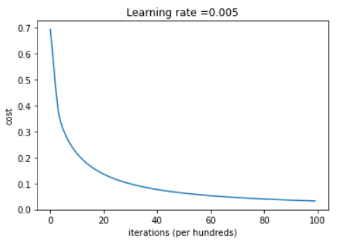
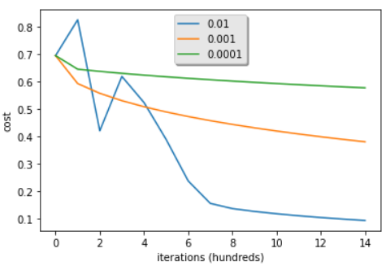

# Simple Cat Analyser

## Problem: Differentiate between a cat and a non-cat image using a neural network.

Given a train and a test dataset labeled with cat and non-cat images, we must train an algorithm to tell if the input image is a cat (1) or not a cat (0).

The algorithm is implemented using Logistic Regression, with the Cost Function as a measure of how well our learning algorithm is doing.

**Mathematical expression of the algorithm**:

For one example $x^{(i)}$:

$$z^{(i)} = w^T x^{(i)} + b \tag{1}$$
$$\hat{y}^{(i)} = a^{(i)} = sigmoid(z^{(i)})\tag{2}$$ 
$$ \mathcal{L}(a^{(i)}, y^{(i)}) =  - y^{(i)}  \log(a^{(i)}) - (1-y^{(i)} )  \log(1-a^{(i)})\tag{3}$$

The cost is then computed by summing over all training examples:
$$ J = \frac{1}{m} \sum_{i=1}^m \mathcal{L}(a^{(i)}, y^{(i)})\tag{6}$$

In the final tests, the training accuracy is close to 100%, wich is a good sign that our model is able to fit the training data. The test accuracy is 70%, which is not a bad result, given the small dataset used. 

We plotted the cost as a function of iterations, where we can see the cost decreasing as the parameters are being learned. 

And the dependece on the learning rate, where we see that different rates give different costs, predicting different results. Also, when the learning rate is too large, the cost oscillates.

## Testing with an online image

Finally, there is an implementation where you can test with your online image. Here are some examples:

